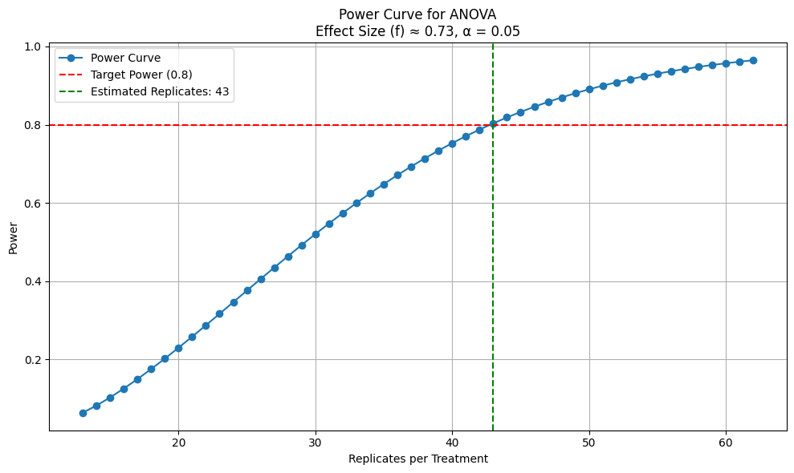

# 🔬 LLM Code Refinery

**An experimental framework for evaluating collaborative code generation with large language models using verifiable rewards.**

This project explores how LLM agents collaborate to iteratively generate and optimize code within a controlled experimental design. By varying the number of agents and the optimization strategy (iterations or time limit), we evaluate collaboration dynamics through verifiable rewards — specifically, whether generated programs execute correctly and how efficiently they run. Execution time serves as an objective, measurable signal of performance, allowing us to assess reliability without relying on subjective judgments. Although the statistical power achieved in this pilot was limited, the project demonstrates the potential of combining experimental design with verifiable evaluation criteria to rigorously measure LLM performance.

---

## 📘 Project Overview

**LLM Code Refinery** explores the capabilities of GPT-4o agents working individually and in teams to solve a defined programming task under different time and iteration constraints. The experiment simulates a collaborative coding environment where agents take turns refining each other’s solutions across multiple iterations.

### Experiment Design

We varied two primary factors:

- **Number of collaborating agents:** 1, 2, or 3
- **Optimization strategy:**
  - Fixed number of iterations (3 or 8)
  - Fixed time budget (1 minute or 2 minutes)

This results in **12 unique treatment combinations** (`3 agent settings × 4 optimization settings`), with **2 replicates per treatment**, totaling **24 generated programs**.

## ✨ Inspiration

This project was inspired by [Max Woolf's article](https://minimaxir.com/2025/01/write-better-code/), *“Can LLMs write better code if you keep asking them to “write better code”?”*, published on January 2nd, 2025. In the article, Woolf explored how LLMs perform on open-ended programming prompts. One of his examples asked models to solve a numerical filtering task involving large input data.

Building on that idea, this project used a refined version of his prompt:

> *Write Python code to solve this problem: Given a list of 1 million random integers between 1 and 100,000, find the difference between the smallest and the largest numbers whose digits sum up to 30.*

This became the core task used to evaluate how LLM agents iteratively collaborate and optimize code under various experimental settings.

---

### Task Description

Agents were instructed to write a function:

```python
def get_difference(numbers):
    # Given 1M random integers between 1 and 100,000,
    # return the difference between the smallest and largest
    # numbers whose digits sum up to 30.
```

The exact prompt I used was:

>*Write a function `get_difference` that takes a list of 1 million random integers (each between 1 and 100,000) as input and returns an integer: the difference between the smallest and largest numbers in the list whose digits sum up to 30.*

Programs were generated iteratively by rotating the lead agent per iteration. Under time-constrained settings, a background timer interrupted the process, and the most recent program was selected as the output.

Each program was executed **twice** using two different random lists (1 million integers each), giving us **4 runtime measurements per replicate** and **96 total measurements**. Execution time (in seconds) was the response variable.

---

## 📊 Statistical Analysis & Power Estimation

Following the experiment:

- Execution time data was aggregated by replicate.
- A **power analysis** was conducted using ANOVA to evaluate the sensitivity of the experiment.

### Key Findings

- **Observed statistical power**: `~35%`
- **Target power**: `80%`
- **Required replicates per treatment**: `~43`
- **Estimated future experiment cost**: `~$40` (based on pilot cost of $1.93 for 2 replicates on March 2nd, 2025)

To detect a meaningful effect size of **0.5 seconds**, future experiments must significantly increase sample size or effect size to reach sufficient statistical power.



---

## ⚙️ Setup

1. **Install dependencies using Poetry:**

    ```bash
    poetry install
    ```

2. **Add your OpenAI API key to a `.env` file:**

    ```env
    OPENAI_API_KEY=your_key_here
    ```

---

## 🚀 Running the Experiment

### 1. Generate code solutions

```bash
python main.py
```

Runs all experimental conditions and saves generated programs in `programs/`.

### 2. Measure performance

```bash
python measure.py
```

Executes generated programs and logs timing data in `timing_results.csv`.

### 3. Summarize results

```bash
python summarize.py
```

Processes raw measurements into `experiment_data.csv`.

### 4. Conduct power analysis

Open and run `power-analysis.ipynb` in Jupyter to:

- Analyze the statistical power of the current results
- Estimate needed sample sizes for future runs
- Visualize power curves

---

## 🗂️ Project Structure

| File / Folder            | Description                                   |
|--------------------------|-----------------------------------------------|
| `main.py`                | Core script to generate solutions              |
| `measure.py`             | Measures execution times of solutions          |
| `summarize.py`           | Aggregates and summarizes performance data     |
| `power-analysis.ipynb`   | Jupyter notebook for statistical power analysis |
| `programs/`              | Generated Python solutions by the agents       |
| `timing_results.csv`     | Raw execution time measurements                |
| `experiment_data.csv`    | Cleaned and summarized dataset                 |

---

## 📌 Conclusions & Future Work

This pilot study highlights the feasibility and potential of simulating collaborative code optimization with LLMs. Key takeaways include:

- **Low power (35%) limits the reliability** of current conclusions.
- **Future experiments require 43+ replicates per treatment** to confidently detect modest improvements (~0.5s).
- **Cost-effective scaling** will be crucial for more robust validation.
- Agent collaboration shows promise, and future experiments could explore:
  - More diverse programming tasks
  - Agent memory and feedback loops
  - Fine-tuning agents for coordinated team dynamics

By combining statistical rigor with creative experimentation, **LLM Code Refinery** opens the door to a deeper understanding of how AI agents can co-create performant software. It also demonstrates the value of applying experimental design methodologies to LLM behavior — offering a new lens through which to assess **accuracy**, **hallucination rates**, and **emergent collaboration** across a variety of tasks.

Given the high number of replicates needed to achieve acceptable statistical power, a **simplified version of the experiment with fewer treatment combinations** could be a practical next step, allowing for more focused and cost-efficient exploration.
